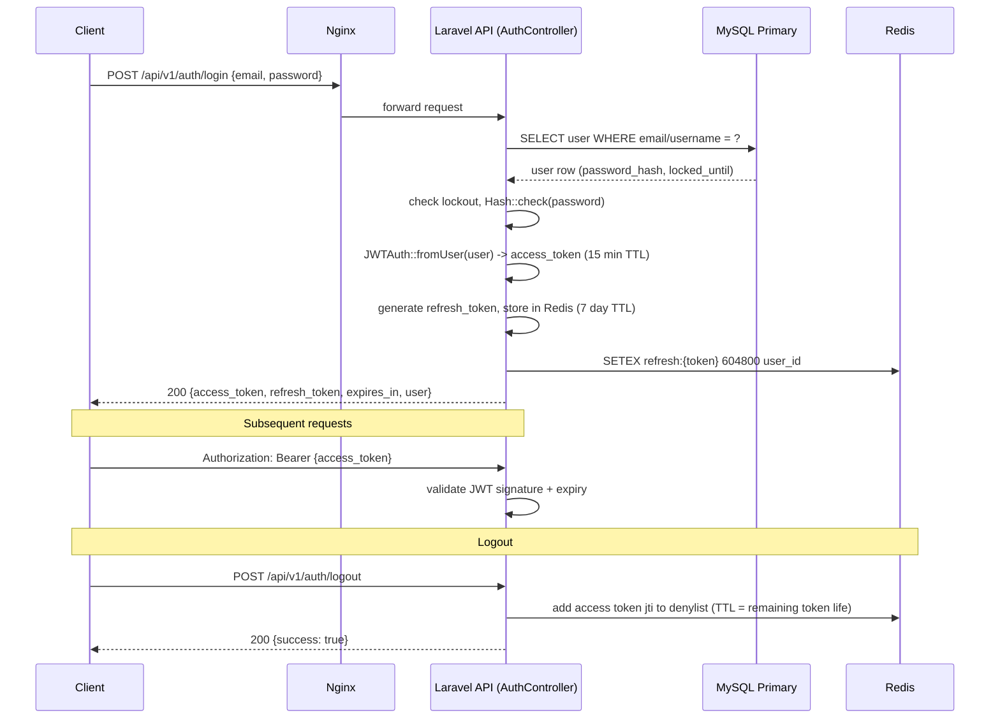
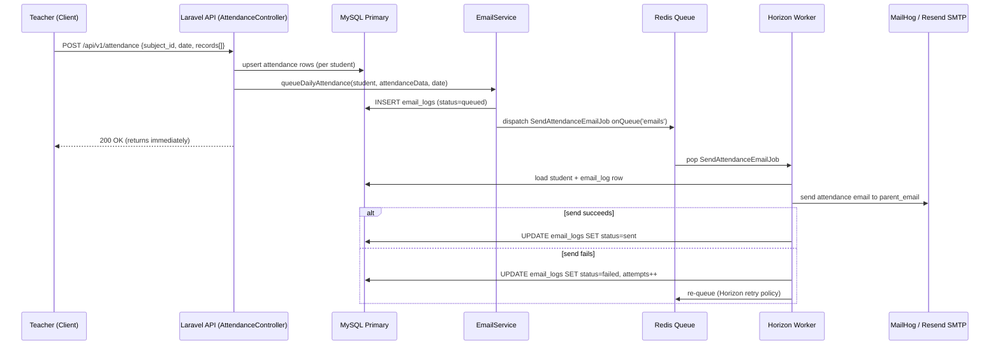
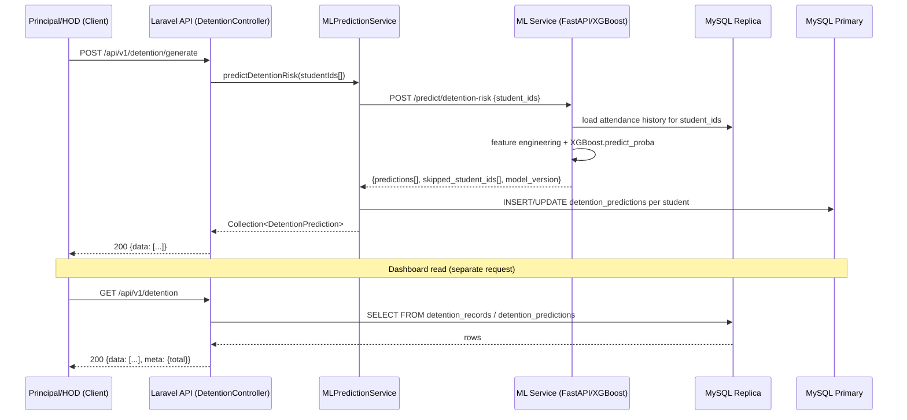

# Architecture

This document describes the four-tier architecture of the Attendance &
Detention Management System and the reasoning behind its key design
decisions. For a high-level diagram and quick start, see the
[project README](../README.md).

## The Four Tiers

**Edge.** Nginx terminates incoming HTTP traffic and reverse-proxies it to the
Laravel API container. It is the only service exposed on port 80, and is
configured to be CloudFlare-ready (so TLS, WAF, and static-asset caching can
be added in front of it without changing application code).

**Application.** The Laravel 13 / PHP 8.3 API (`api/`) is stateless — every
request is authenticated via a JWT bearer token, so no session affinity is
required and the API container can be scaled horizontally behind Nginx.
Controllers live under `app/Http/Controllers/Api/V1`, business logic in
`app/Services`, and data access in `app/Repositories`.

**Async.** Redis backs both the cache and the queue. Laravel Horizon runs as
a separate worker container, processing two kinds of background work:
outbound parent-notification emails (`SendAttendanceEmailJob`,
`SendDetentionEmailJob`) and detention-risk prediction calls to the ML
service. Offloading these to a queue keeps API response times low and makes
email delivery retryable.

**Data.** MySQL 8 runs as a primary (read/write) plus a read replica.
`config/database.php` defines a named `read` connection (`mysql::read`) that
`AttendanceRepository` and reporting queries use explicitly; the connection
is marked `sticky` so a request that just wrote data reads its own write back
from the primary rather than a potentially-lagging replica. The `attendance`
table is partitioned by month (see
`api/database/migrations/2026_06_08_100100_partition_attendance_table_by_month.php`)
so dashboard and monthly-report queries only scan relevant partitions.

**ML microservice.** A separate FastAPI application (`ml-service/`) reads
from the MySQL replica and serves an XGBoost classifier over HTTP. Laravel's
`MLPredictionService` calls it via `Http::baseUrl(config('services.ml_service.url'))`
and persists the results to the `detention_predictions` table. Running this
as its own container means the model can be retrained and redeployed
independently of the web application.

## Sequence Diagrams

### 1. Login flow (JWT issuance + Redis refresh storage)

### 2. Attendance marking → queue → worker → SMTP → email_logs

### 3. Detention prediction call (Laravel → FastAPI → DB → dashboard)

## Decisions

**Why JWT over sessions?** The API needs to scale horizontally behind Nginx
without sticky sessions or a shared session store being a hard dependency.
JWT access tokens are short-lived (15 minutes) and self-contained, so any API
instance can validate a request without a round trip. The well-known downside
— you can't revoke a JWT before it expires — is solved with a Redis-backed
denylist that `logout` writes to, checked on every authenticated request.

**Why a queue over synchronous email?** Sending email synchronously inside
the `POST /attendance` request would tie the response time to SMTP latency
and any transient mail-server failures. Dispatching `SendAttendanceEmailJob`
to a Redis queue lets the API return immediately, and Horizon's retry policy
absorbs transient SMTP failures without the teacher seeing an error. The
`email_logs` table gives an audit trail of what was sent, queued, or failed.

**Why a read replica?** Dashboard and reporting queries (HOD/Principal
summaries, detention listings) can be expensive aggregations. Routing them
through the named `read` connection keeps that load off the primary, which
needs to stay responsive for attendance writes. The `sticky` flag avoids the
classic "I just submitted attendance and it's not showing up yet" problem
caused by replication lag.

**Why a separate microservice for ML?** Keeping the XGBoost model in a
Python/FastAPI service rather than embedding it in Laravel means the model
can be retrained and redeployed on its own schedule, by a different
toolchain (scikit-learn/XGBoost/pandas), without rebuilding or restarting the
PHP application. It also isolates a Python dependency tree from the PHP one,
and the read-only replica connection means the ML service cannot accidentally
write to production data.
